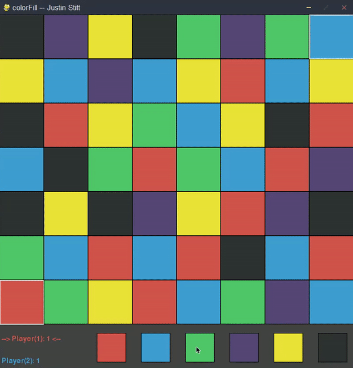
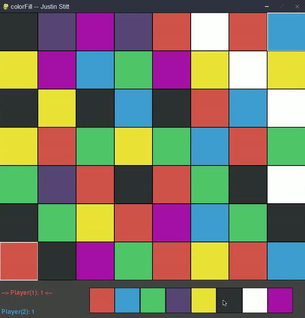

# colorFill
A color-based territory game!

The goal is to conquer as much territory as possible. The player with the most territory at the end of the game is the winner.

Strategic selection of colors is the goal to winning.

By default there are 6 colors and you cannot, at any point in the game, choose the color of your opponent or yourself. So at any given point you have 4 colors to choose from to help conquer more territory.

You can have as many colors(>= 2) as you want, however gameplay will vary with different amounts of colors.

--new update: You can now scale the size of the grid. (longer --and more tedious-- games will ensue)  
(see insane 20x20, 10 color gameplay below)

**THRILLING GAMEPLAY**

**8 COLORS GAMEPLAY**

**Game Between Two AI's on 20x20 Grid with 10 Colors**

